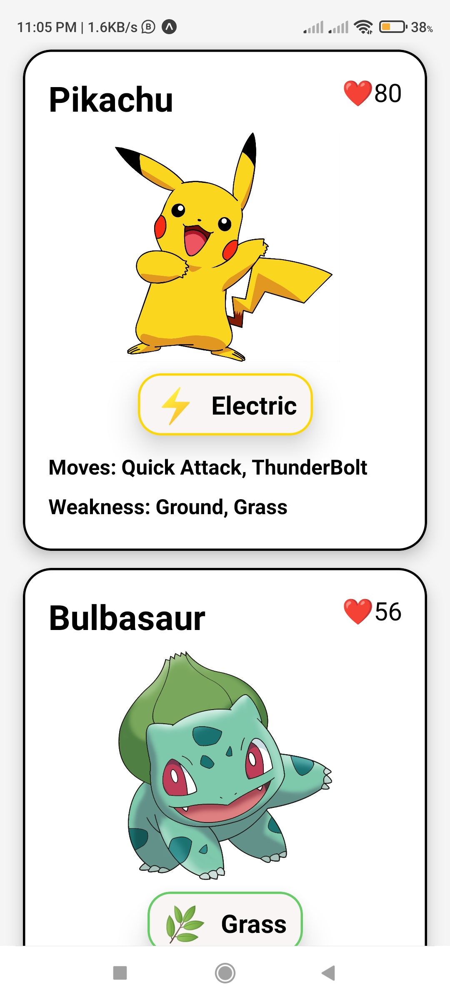
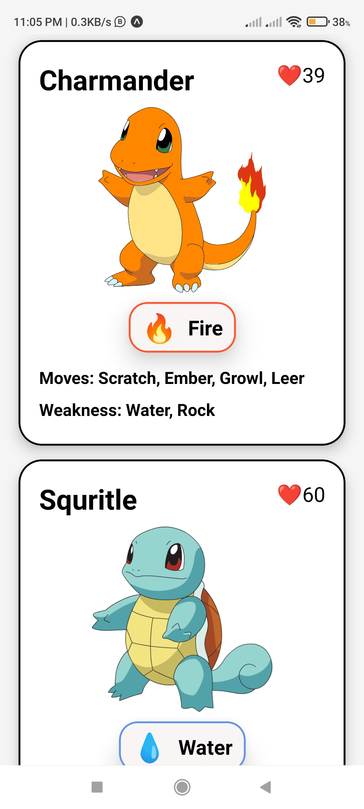

# Pokemon Card

This project showcases a simple React Native component for displaying Pokemon cards. 
It provides a visually appealing layout to display various details of a Pokemon,
such as its name, image, type, HP, moves, and weakness.

## Features

- Display Pokemon name, image, type, HP, moves, and weakness.
- Customizable card styling with CSS-like properties.
- Easy to integrate into any React Native application.
  
## Screenshots

    
    

